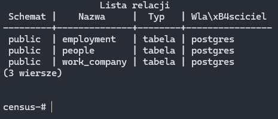
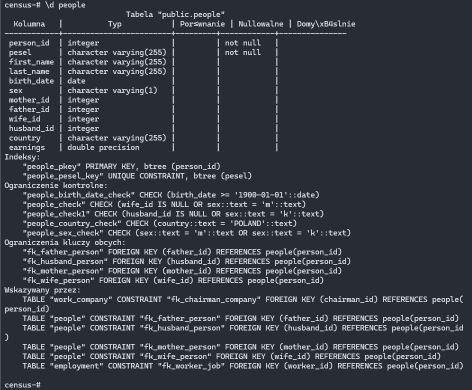
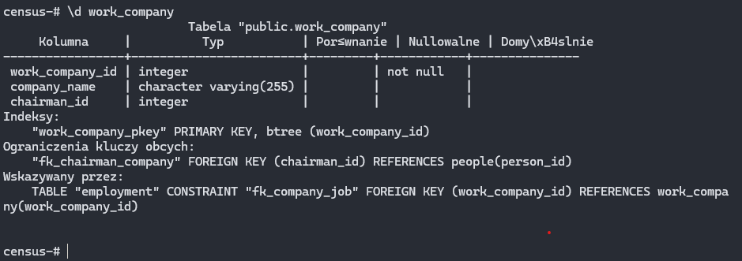
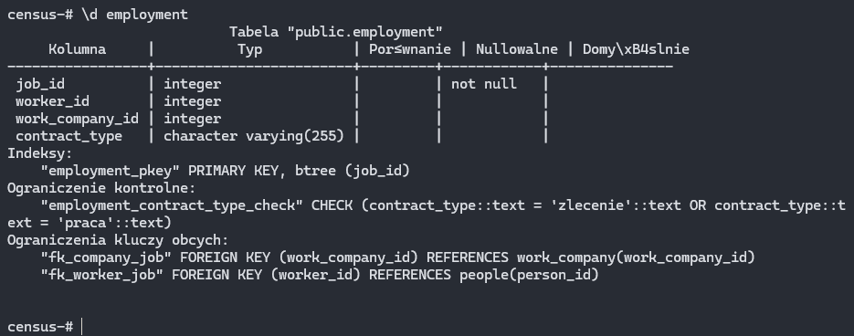
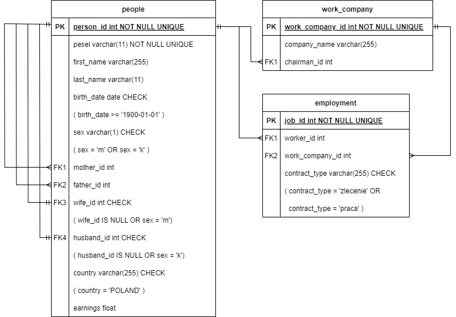
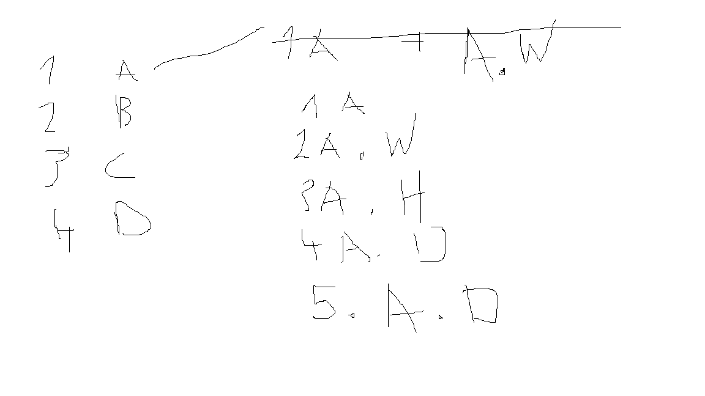

<h1>SQL Databse and it's querries.</h1>

<h3><a href="#task_a">Querry - Task A<a/><h3/>
<h3><a href="#task_b">Querry - Task B<a/><h3/>
<h3><a href="#task_c">Querry - Task C<a/><h3/>

<h2>SQLite</h2>

create database

```shell
sqlite3 census.db
```

list tables

```shell
.tables
```

table schema

```shell
.schema tablename
```

set output formating
```shell
.mode column
.headers on
```

sqlite help

```shell
.help
```


<!-- postgresql database -->
<!-- problems with utf-8 -->

<!-- 
<h2>Created Tables</h2>

SET client_encoding = 'UTF8';

<p align="center">
<br/>
<i>Created tables</i>
</p>

<p align="center">
<br/>
<i>Definition of people table</i>
</p>

<p align="center">
<br/>
<i>Definition of work_company table</i>
</p>

<p align="center">
<br/>
<i>Definition of employment table</i>
</p>
-->


<h2>Generating Data</h2>

<p align="center">
<br/>
<i>Created tables</i>
</p>

<ul>
    <li><i>my_create.sql</i> - definition of the tables</li>
    <li>data</li>
    <ul>
        <li><i>add_people.sql</i> - add data to people table</li>
        <li><i>add_work_company.sql</i> - add data to work_company table</li>
        <li><i>add_employment.sql</i> - add data to employment table</li>
    </ul>
</ul>
<p>Chat GPT an Perplexity were used to generate data to feed the database.</p>

Find duplcated PESELs - works

```shell
grep -oE '\b[0-9]{11}\b' add_people.sql | sort | uniq -d
```

Find duplcated PESELs - doesn't work

```shell
# regex
\b(\d{11})\b(?=.*\b\1\b)

grep -oE '\b[0-9]{11}\b' add_people.sql | sort | uniq -d | grep -Ff - add_people.sql

# didn't try
grep -oE '\b[0-9]{11}\b' add_people.sql | awk '{count[$0]++} END {for (num in count) if (count[num] > 1) print num}'
```

substitute part of a string<br/>
in this case:<br/>
change every 5-zeros string like "0000" into ranfom 5-digit number

```shell
# didn't try
while grep -q "00000" file.txt; do
    sed -i "0,/00000/s//$(shuf -i 10000-99999 -n 1)/" file.txt
done

# works
perl -i -pe 's/00000/sprintf("%05d", int(rand(100000)))/ge' file.txt
```

<h3>Modyfying Table</h3>

Remove earnings from insert querry

```shell
sed -E 's/(, earnings)//; s/,\s[0-9]+\.[0-9]+\)/\)/' add_people.sql > output_file.sql
```

Adding salary column to insert querry add_employment.sql<br/>
See <i>modify_add_employment.py</i><br/>


<h2>Table Indexing</h2>

```sql
CREATE INDEX idx_first_name ON people (first_name);
CREATE INDEX idx_last_name ON people (last_name);
CREATE INDEX idx_pesel ON people (pesel);

CREATE INDEX idx_oneGenerationFamily_manAsRoot
ON people (person_id, wife_id);
CREATE INDEX idx_oneGenerationFamily_womanAsRoot
ON people (person_id, husband_id);

CREATE INDEX
idx_oneGenerationFamily_withParents_manAsRoot
ON people (person_id, wife_id, father_id);
CREATE INDEX
idx_oneGenerationFamily_withParents_womanAsRoot
ON people (person_id, husband_id, mother_id);
```

Deleting Indexes Example<br/>

```sql
ALTER TABLE people DROP INDEX idx_first_name;
```

<h1>Querries</h1>


<!-- =============================================================================== -->


<h2 id="task_a">Task A</h2>

<p>Find the name and surname of the person with the most female grandchildren.</p>

Men - sex = 'm'<br/>
Woman - sex = 'k'<br/>

<h3>Add test records<h3/>

```sql
-- Update random person and use it as a granny
UPDATE people
SET first_name = 'Granny', last_name = 'The most of granddoughters'
WHERE person_id = 155;

UPDATE people
SET first_name = 'Granny', last_name = 'The most of grandsons'
WHERE person_id = 256;

-- Insert Grandchildren
-- ... see querries.sql
```


<h3>Solved by one command using chat-gpt help<h3/>

```sql
SELECT
    p1.first_name, 
    p1.last_name,
    COUNT(p3.person_id) AS female_grandchildren_count
FROM 
    people p1
JOIN 
    people p2 ON (p2.mother_id = p1.person_id OR p2.father_id = p1.person_id)
JOIN 
    people p3 ON (p3.mother_id = p2.person_id OR p3.father_id = p2.person_id)
WHERE 
    p3.sex = 'k'
GROUP BY 
    p1.person_id, p1.first_name, p1.last_name
ORDER BY 
    female_grandchildren_count DESC
LIMIT 1;
```

output
```
first_name  last_name                   female_grandchildren_count
----------  --------------------------  --------------------------
Granny      The most of granddoughters  10
```


<h3>My method with a use of views pipeline</h3>

```sql
CREATE VIEW persons_female_grandchildren_count AS
    SELECT
        p1.person_id,
        p1.first_name, 
        p1.last_name,
        COUNT(p3.person_id) AS female_grandchildren_count
    FROM 
        people p1
    JOIN 
        people p2 ON (p2.mother_id = p1.person_id OR p2.father_id = p1.person_id)
    JOIN 
        people p3 ON (p3.mother_id = p2.person_id OR p3.father_id = p2.person_id)
    WHERE 
        p3.sex = 'k'
    GROUP BY 
        p1.person_id, p1.first_name, p1.last_name
;
SELECT * FROM persons_female_grandchildren_count;


CREATE VIEW all_persons_have_max_granddoughter_count AS
SELECT * FROM persons_female_grandchildren_count
WHERE 
    female_grandchildren_count =
        (SELECT MAX(female_grandchildren_count) FROM persons_female_grandchildren_count)
;
SELECT * FROM all_persons_have_max_granddoughter_count;


CREATE VIEW one_person_have_max_granddoughter_count AS
SELECT * FROM all_persons_have_max_granddoughter_count
ORDER BY person_id ASC
LIMIT 1;
SELECT * FROM one_person_have_max_granddoughter_count;


-- FINAL VIEW
CREATE VIEW TASK_A AS
SELECT * FROM one_person_have_max_granddoughter_count;
SELECT * FROM TASK_A;
```

output
```
sqlite> SELECT * FROM TASK_A;
person_id  first_name  last_name                   female_grandchildren_count
---------  ----------  --------------------------  --------------------------
155        Granny      The most of granddoughters  10
sqlite>
```


<!-- =============================================================================== -->


<h2 id="task_b">Task B</h2>

<p>Present the average number of employees employed under a mandate contract and the average number of employees employed under an employment contract in all companies and the average salary for these contracts.</p>

<h3>Chat GPT answer<h3/>

```sql
DROP VIEW gpt_1;
CREATE VIEW gpt_1 AS
WITH contract_counts AS (
    SELECT
        work_company_id,
        contract_type,
        COUNT(worker_id) AS employee_count,
        AVG(salary) AS average_salary
    FROM
        employment
    GROUP BY
        work_company_id,
        contract_type
)

SELECT
    contract_type,
    AVG(employee_count) AS avg_employee_count,
    AVG(average_salary) AS avg_salary
FROM
    contract_counts
GROUP BY
    contract_type;
SELECT * FROM gpt_1;
```

output (wrong)
```
sqlite> SELECT * FROM gpt_1;
contract_type  avg_employee_count  avg_salary
-------------  ------------------  ----------------
employment     10.0                14360.5565833333
mandate        9.0                 14763.3918518519
sqlite>
```


<h3>My edit of Chat GPT answer<h3/>

```sql
DROP VIEW gpt_2;
CREATE VIEW gpt_2 AS
WITH contract_counts AS (
    SELECT
        work_company_id,
        contract_type,
        COUNT(worker_id) AS employee_count,
        AVG(salary) AS average_salary
    FROM
        employment
    GROUP BY
        work_company_id,
        contract_type
)

SELECT
    work_company_id,
    contract_type,
    AVG(employee_count) AS avg_employee_count,
    AVG(average_salary) AS avg_salary
FROM
    contract_counts
GROUP BY
    work_company_id,
    contract_type;
SELECT * FROM gpt_2;
```

output (wrong, but interesting)
```
sqlite> SELECT * FROM gpt_2;
work_company_id  contract_type  avg_employee_count  avg_salary
---------------  -------------  ------------------  ----------------
1                employment     10.0                10467.879
2                mandate        9.0                 15747.3622222222
3                employment     10.0                11836.202
3                mandate        9.0                 14710.3266666667
4                employment     10.0                15872.558
4                mandate        9.0                 18280.0877777778
5                employment     10.0                15871.64
5                mandate        9.0                 14347.32
...
```


<h3>Result of my ask chat-GPT to correct querry<br/>
+ MY EDIT (now it is right)<h3/>


```sql
DROP VIEW gpt_3;
CREATE VIEW gpt_3 AS
WITH contract_counts AS (
    SELECT
        employment.work_company_id,
        company_name,
        contract_type,
        COUNT(worker_id) AS employee_count,
        AVG(salary) AS average_salary
    FROM
        employment
    LEFT JOIN work_companies
    ON work_companies.work_company_id = employment.work_company_id
    GROUP BY
        employment.work_company_id,
        contract_type
)

SELECT
    cc1.work_company_id,
    cc1.company_name,
    COALESCE(cc1.employee_count, 0) AS mandate_employee_count,
    COALESCE(cc1.average_salary, 0) AS mandate_avg_salary,
    COALESCE(cc2.employee_count, 0) AS employment_employee_count,
    COALESCE(cc2.average_salary, 0) AS employment_avg_salary
FROM
    (SELECT * FROM contract_counts WHERE contract_type = 'mandate') cc1
FULL OUTER JOIN
    (SELECT * FROM contract_counts WHERE contract_type = 'employment') cc2
ON
    cc1.work_company_id = cc2.work_company_id;
SELECT * FROM gpt_3;
```

output (wrong, but interesting)
```
sqlite> SELECT * FROM gpt_3;
work_company_id  company_name          mandate_employee_count  mandate_avg_salary  employment_employee_count  employment_avg_salary
---------------  --------------------  ----------------------  ------------------  -------------------------  ---------------------
2                Green Energy Corp     9                       15747.3622222222    0                          0
3                Innovatech            9                       14710.3266666667    10                         11836.202
4                Blue Horizon          9                       18280.0877777778    10                         15872.558
5                Quantum Industries    9                       14347.32            10                         15871.64
6                Future Vision         9                       15932.1711111111    10                         12926.978
...
```


<h3/>MY method to solve it by VIEWS<h3/>

```sql
-------------------------

-- count mandates, group by company
-- employment_company_id__employment_contract_type=mandate_count
DROP VIEW e_c_id__e_m_count;
CREATE VIEW e_c_id__e_m_count AS
SELECT
e.work_company_id AS work_company_id,
e.contract_type AS contract_type,
COUNT(*) AS mandate_count
FROM employment e WHERE e.contract_type = 'mandate'
GROUP BY e.work_company_id;
SELECT * FROM e_c_id__e_m_count;

-- count employment, group by company
-- employment_company_id__employment_contract_type=employment_count
DROP VIEW e_c_id__e_e_count;
CREATE VIEW e_c_id__e_e_count AS
SELECT
e.work_company_id AS work_company_id,
e.contract_type AS contract_type,
COUNT(*) AS employment_count
FROM employment e WHERE e.contract_type = 'employment'
GROUP BY e.work_company_id;
SELECT * FROM e_c_id__e_e_count;

-- ++++++++++++++++++++++++++++++++++++++

-- average mandates salary, group by company
-- employment_company_id__employment_contract_type=mandate_salary
DROP VIEW e_c_id__e_avg_m_s;
CREATE VIEW e_c_id__e_avg_m_s AS
SELECT
e.work_company_id AS work_company_id,
e.contract_type AS contract_type,
AVG(e.salary) AS mandate_avg_salary
FROM employment e WHERE e.contract_type = 'mandate'
GROUP BY e.work_company_id;
SELECT * FROM e_c_id__e_avg_m_s;

-- average employment salary, group by company
-- employment_company_id__employment_contract_type=employment_salary
DROP VIEW e_c_id__e_avg_e_s;
CREATE VIEW e_c_id__e_avg_e_s AS
SELECT
e.work_company_id AS work_company_id,
e.contract_type AS contract_type,
AVG(e.salary) AS employment_avg_salary
FROM employment e WHERE e.contract_type = 'employment'
GROUP BY e.work_company_id;
SELECT * FROM e_c_id__e_avg_e_s;

-- ++++++++++++++++++++++++++++++++++++++

DROP VIEW company_id_mandate_count_avg;
CREATE VIEW company_id_mandate_count_avg AS
SELECT
e_c_id__e_m_count.work_company_id,
e_c_id__e_m_count.contract_type,
mandate_count,
mandate_avg_salary
FROM e_c_id__e_m_count, e_c_id__e_avg_m_s
GROUP BY e_c_id__e_m_count.work_company_id;
SELECT * FROM company_id_mandate_count_avg;

DROP VIEW company_id_employment_count_avg;
CREATE VIEW company_id_employment_count_avg AS
SELECT
e_c_id__e_e_count.work_company_id,
e_c_id__e_e_count.contract_type,
employment_count,
employment_avg_salary
FROM e_c_id__e_e_count, e_c_id__e_avg_e_s
GROUP BY e_c_id__e_e_count.work_company_id;
SELECT * FROM company_id_employment_count_avg;


-- ++++++++++++++++++++++++++++++++++++++

-- TO TEST JOIN
SELECT * FROM employment WHERE contract_type = 'mandate' AND work_company_id = 1;
DELETE FROM employment WHERE contract_type = 'mandate' AND work_company_id = 1;
SELECT * FROM employment WHERE contract_type = 'mandate' AND work_company_id = 1;

-- TO TEST JOIN
SELECT * FROM employment WHERE contract_type = 'employment' AND work_company_id = 2;
DELETE FROM employment WHERE contract_type = 'employment' AND work_company_id = 2;
SELECT * FROM employment WHERE contract_type = 'employment' AND work_company_id = 2;


-- ++++++++++++++++++++++++++++++++++++++


DROP VIEW no_name;
CREATE VIEW no_name AS
SELECT
* FROM company_id_mandate_count_avg
FULL OUTER JOIN company_id_employment_count_avg ON
company_id_mandate_count_avg.work_company_id =
company_id_employment_count_avg.work_company_id;
SELECT * FROM no_name;


-- FINAL VIEW

DROP VIEW TASK_B;
CREATE VIEW TASK_B AS
SELECT
no_name.work_company_id,
work_companies.company_name,
no_name.contract_type,
no_name.employment_count,
no_name.employment_avg_salary
FROM no_name
LEFT JOIN work_companies
ON work_companies.work_company_id = no_name.work_company_id
GROUP BY no_name.work_company_id;
SELECT * FROM TASK_B;
```

output
```
sqlite> SELECT * FROM TASK_B;
work_company_id  company_name          contract_type  employment_count  employment_avg_salary
---------------  --------------------  -------------  ----------------  ---------------------
                                                      10                10467.879
2                Green Energy Corp     mandate
3                Innovatech            mandate        10                10467.879
4                Blue Horizon          mandate        10                10467.879
5                Quantum Industries    mandate        10                10467.879
6                Future Vision         mandate        10                10467.879
...
```


<!-- =============================================================================== -->


<h2>Task C</h2>

<p>Find a family (at most 2 generations) that earns the least. Provide the name and surname of any person in that family.<p/>





```sql
------------------------------------------- GOOD

DROP VIEW persons_family_members;
CREATE VIEW
persons_family_members AS

SELECT
p.person_id AS person_id,
p.first_name AS person_first_name,
p.last_name AS person_last_name,
fm.person_id AS family_member_id,
fm.first_name AS family_member_first_name,
fm.last_name AS family_member_last_name

FROM
people p

CROSS JOIN
people fm
WHERE
fm.person_id IN (
p.person_id,
p.husband_id,
p.mother_id
)
OR
fm.mother_id = p.person_id
OR
fm.father_id = p.person_id

ORDER BY
p.person_id;
SELECT * FROM persons_family_members;

------------------------------------------- GOOD
------------------------------------------- GOOD

DROP VIEW persons_family_members_salaries;
CREATE VIEW
persons_family_members_salaries AS
SELECT
pfm.person_id AS person_id,
pfm.person_first_name AS person_first_name,
pfm.person_last_name AS person_last_name,
pfm.family_member_id AS family_member_id,
pfm.family_member_first_name AS family_member_first_name,
pfm.family_member_last_name AS family_member_last_name,
e.salary AS family_member_salary

FROM
persons_family_members pfm

CROSS JOIN
employment e
ON e.worker_id = pfm.family_member_id;
SELECT * FROM persons_family_members_salaries;

------------------------------------------- GOOD
------------------------------------------- GOOD

DROP VIEW persons_family_members_salaries_count;
CREATE VIEW
persons_family_members_salaries_count AS
SELECT
pfms.person_id,
pfms.family_member_id,
COUNT(pfms.family_member_salary) AS family_member_salary_count
FROM persons_family_members_salaries pfms
GROUP BY
pfms.person_id, pfms.family_member_id
ORDER BY family_member_salary_count;
SELECT * FROM persons_family_members_salaries_count;

------------------------------------------- GOOD
------------------------------------------- GOOD

DROP VIEW persons_family_income;
CREATE VIEW
persons_family_income AS
SELECT
pfms.person_id,
pfms.person_first_name,
pfms.person_last_name,
SUM(pfms.family_member_salary) AS family_income
FROM persons_family_members_salaries pfms
GROUP BY
pfms.person_id,
pfms.person_first_name,
pfms.person_last_name
-- ORDER BY person_id;
ORDER BY family_income ASC;
SELECT * FROM persons_family_income;

------------------------------------------- GOOD
------------------------------------------- GOOD

DROP VIEW TASK_C;
CREATE VIEW TASK_C AS
SELECT * FROM persons_family_income
LIMIT 1;
SELECT * FROM TASK_C;

------------------------------------------- GOOD
```

output
```
sqlite> SELECT * FROM TASK_C;
person_id  person_first_name  person_last_name  family_income
---------  -----------------  ----------------  -------------
140        Tomasz             Sadowski          4309.71
sqlite>
```